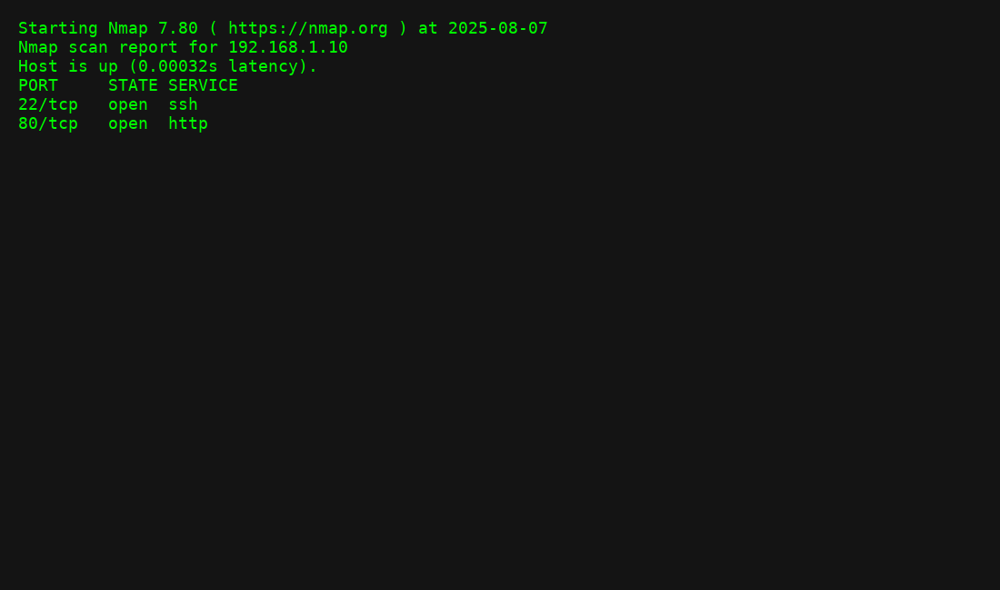
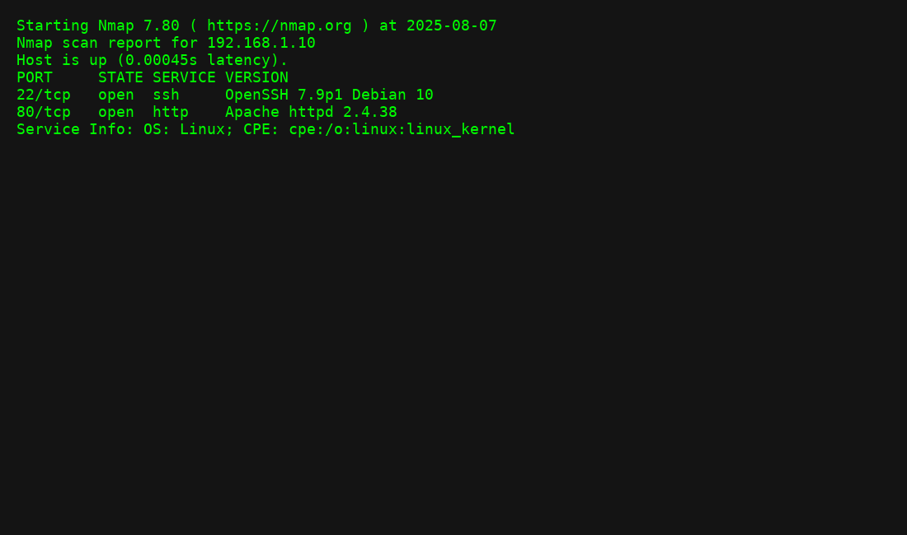

[README.md](https://github.com/user-attachments/files/21673536/README.md)
# Nmap Basics Lab

This lab demonstrates using **Nmap** for basic network scanning and service detection.

## Commands Used
```bash
nmap -sS -T4 -p 1-1000 192.168.1.0/24
nmap -sV 192.168.1.10
```

## Sample Output



## Lessons Learned
- `-sS` performs a stealth SYN scan.
- `-T4` increases scan speed without overwhelming the network.
- `-sV` detects service versions for deeper analysis.
